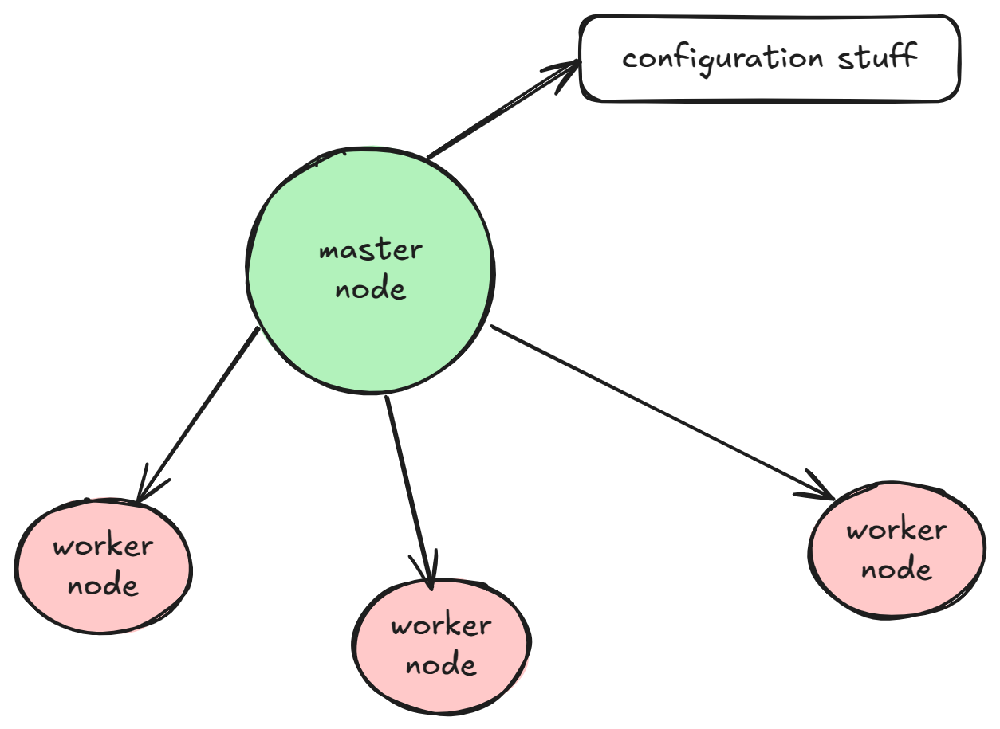

# Beginners Guide

An interesting point about the master and worker processes. The master process is the one incharge or reading and running configurations. This must be why you have to use sudo whenever you're doing anything related with configuration i.e testing configuration or restarting etc. The configuration file is **nginx.conf**.

The worker processes are maintained by the master node (IDK what this maintaining is). The master process isn't the one that distrbutes requests to the workers suprisingly. It is the OS that does that. I guess the master process sees no requests?



I was for a second thinking that Nginx cannot serve images and can only server web pages but that's **NOT TRUE**. Images is part of static content

Nginx can have multiple server contexts each describing something that can process requests. Nginx decides the server to send the request to using the **port the server listens at and the server name**

The location block specifies what will be served to a request depending on the URI of the request. When a matching location block is found its URI is appended to the end of the location specified in root to indicate where the data will come from.

> Incoming request with URI /images/45
> We have a location that looks like this:

```conf
location /images/ {
    root /home/user/data;
}
```

> The file at /home/user/data/imags/45 will be served!

If you get a 403 error when trying to serve some content make sure to check the permissions of the folder you are serving content from. To serve content the directories above that folder need to at least have the execute permission for Nginx and the files depending on the type should have read and maybe execute as well

