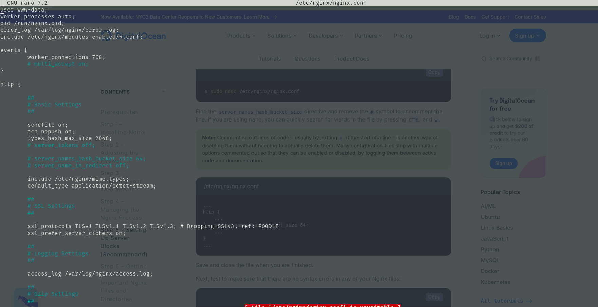

# Configuring Nginx

Nginx configurations are found in the */etc/nginx* directory. An example configuration file can look like this:



A configuration is made up of **contexts** and **declarations**. A context is what you see between the curly braces. Declarations are keys followed by values e.g worker_connections 768

Contexts are where you describe to Nginx how to respond to certain scenarios. For example if we want to tell Nginx how to deal with http requests we put declarations inside the http context i.e

```conf
http {
    declaration value;

    server {
        declaration value;
    }
}
```
