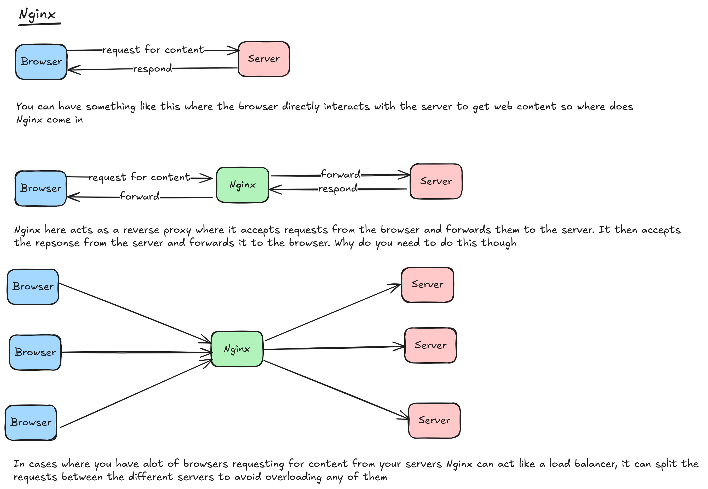

# Introduction

Nginx is a web server. It is used to serve web content to a browser. When someone goes to a site and sees all the text, images etc it was served to them from a web server

This image shows the different ways Nginx can behave: as a reverse proxy and as a load balancer:

In addition to the use cases above Nginx makes it easier to implement encryption when you have multiple servers. One way of implementing encryption would be to implement it on each server but another way is to just implement it on Nginx so that the messages going through Nginx are the ones getting encrypted / decrypted
