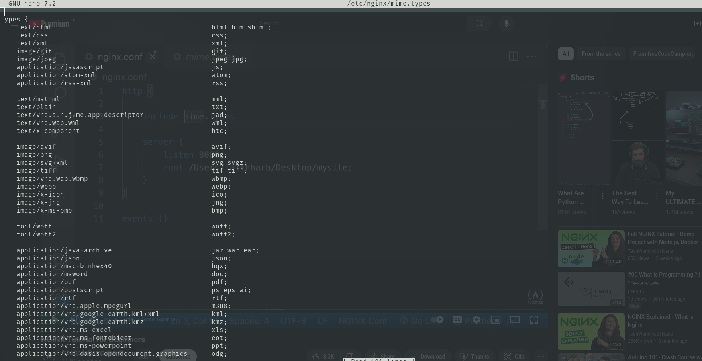

# MIME Types

MIME types are important because they give information about the type of file you are getting. This is useful when you want the browser to get a styles.css file and know that it is a CSS file that defines styles. 

We can tell Nginx the types of files based on the file extension of the file. For example to tell Nginx that files ending with html are html files while those ending with css are style files we can add this to the configuration:

```conf
http {
    types {
        text/html html;
        text/css css;
    }
}
```

They're alot of types that we need to define in our applications. We could write them all manually but luckily Nginx has already defined alot of these types in a mimes.type file that looks like this:



We can see that it has a types context that defines alot of common file types. We can include this in our configuration file like this:

```conf
html {
    include mimes.type;
}
```
