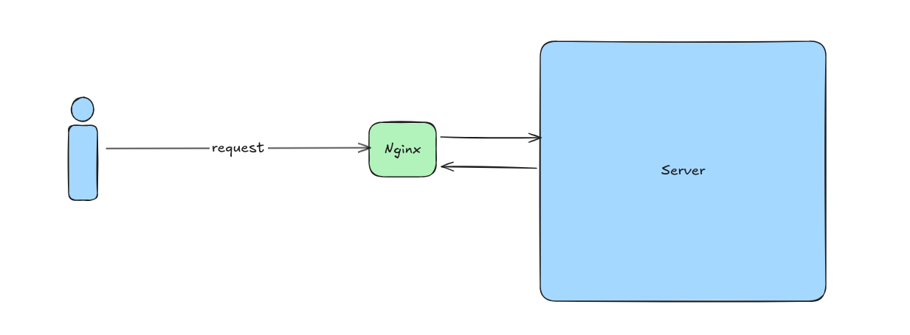
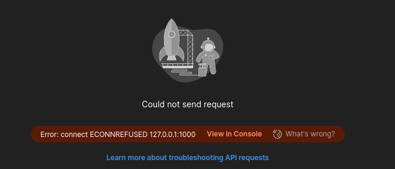

# Nginx Example

The goal is to make a NextJS server reachable using Nginx. 

I would have at first thought that you can just run the server on a VM somewhere and it just works but most likely most Security rules would block requests to ephemeral ports which makes sense so I don't think this is an option.

**I want to check to see if Nginx is running** - Run the command below to see if there are any Nginx processes running. Expect to see one master process running on root and at least one worker process. By default (if you only have default config) you will have 2 worker processes. Having more worker processes increaeses the number of connections to the server that you can handle.

```bash
ps -ef | grep nginx
```

**I want to stop, restart Nginx** - To do these things you need to communicate with the master Nginx processes. You can do this by sending signals with the *nginx -s signal* command. You can send a *reload* signal that reloads the configuration, *stop* signal that immediately stops the Nginx process, *quit* that stops Nginx after its finished processing the requests it has received and *reopen* that reopens log files.

> **BUG REPORT** - incase I send a sigal to the Nginx master processes with the nginx -s signal command and I get an error saying that /run/nginx.pid does not exist it might have something to do with not start the nginx processes nicely. The fix I've found is to restart nginx with sudo systemctl restart nginx or stoping the starting nginx with systemctl. I'm not sure if this is treating a symptom or solving the issue but it worked!

**I want to check if the configuration changes I've made have no errors** - to test the configurations made for errors run the **nginx -t** command.

Nginx's job is to listen for requests, process the one's it is meant to handle and return whatever response is valid for that request. This can be shown by this:



For nginx to process a request you need to have told it that its a valid one. By default nginx will listen and process requests sent on port 80 but requests sent on other ports will not be processed! The request doesn't get handle and you get a **ECONNREFUSED** error:



It might be that Nginx tells the sysem somehow of the ports its using cause the error above isn't Nginx specific.

**Adding a port for Nginx to listen for requests from** - to add a request for Nginx to listen for we need to configure a new server context. This can be done by adding a file that ends with .conf in the conf.d file or in older Nginx installations add an entry in sites-available and symlink it in sites-enabled

The file will contain the block below:

```conf
server {
    listen <port> [default];
}
```

What this does is that it tells Nginx that it should listen for and process requests coming from port <port>. *If you add default it'll tell Nginx that it should use this server block to process requests coming from <port> by default. This is useful when you have multiple processes listening on the same port. What will determine what processes handles the request would be a server_name field.*

> Interestingly enough just adding this will make Nginx handle the request using the default config i.e the default page will be shown

**Reverse Proxying a HTTP server**

> There is a reason I've specified HTTP server. This wouldn't work for a fastCGI server for example. To proxy a FastCGI server use fastcgi_pass. For a UWSGI server use uwsgi_pass. For a SCGI server use scgi_pass and for a memcached server use memcached_pass

To proxy pass a HTTP sever we simply use the *proxy_pass* directive to define where the request will be sent to. For example if you want requests to be handled by localhost:3000 (where our Next site is) use **proxy_pass http://127.0.0.1:3000;**. This is located inside a location block.
